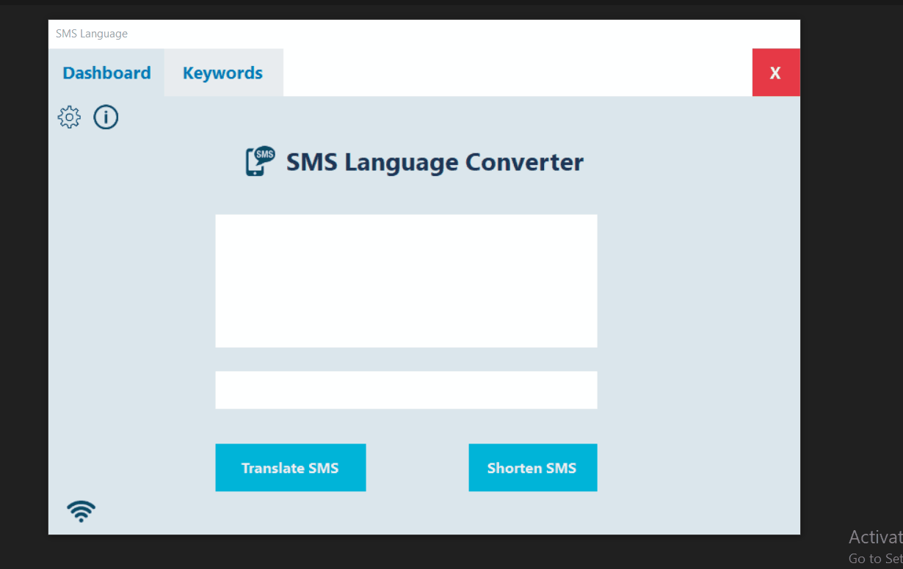

# SMS Language Translator

SMS language translator is a program that translates common SMS abbreviations to their proper forms.

`Example: asap -> as soon as possible`

## Getting Started

These instructions will get you a copy of the project up and running on your local machine.

### Prerequisites

- [.NET Framework](https://dotnet.microsoft.com/download/dotnet-framework)
- [IDE (Preferably Visual Studio)](https://visualstudio.microsoft.com/)

## Usage

1. Clone the repository
1. Start Visual Studio.
1. On the menu bar, choose File -> Open -> Project.
1. Specify location of the project.
1. Click the Run button or press F5 key to execute the project.

## Authors

- **Liul Alemayehu** - _Initial work_

## License

This project is licensed under the [MIT](https://choosealicense.com/licenses/mit/) License
